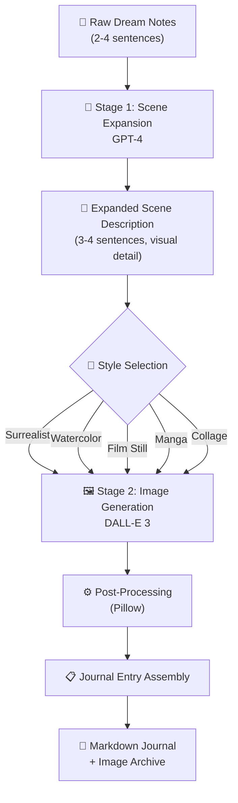

# 🌙 DreamInk

A Python pipeline that transforms raw, fragmented morning dream notes into rich visual illustrations, building a visual dream journal over time. GPT-4 expands fragmentary notes into detailed visual scene descriptions, then DALL-E 3 generates illustrations in a chosen artistic style. Entries accumulate into a browsable Markdown journal with original notes, expanded scenes, thematic tags, and generated artwork.

**Built:** November–December 2023, the week DALL-E 3 launched through the OpenAI API. 🚀

## 🏗️ Architecture



**💡 The core insight:** raw dream notes produce generic "dreamy" images when fed directly to DALL-E 3. The GPT-4 expansion step — with an explicit instruction to *preserve surreal logic* rather than rationalize it — is the difference between "a dreamy underwater scene" and "a specific childhood kitchen with fish in the cabinets and a stained-glass mother refracting waterlight across linoleum."

## ⚡ Quick Start

```bash
# Install
git clone <repo-url> && cd dream-ink
poetry install

# Configure API key
export OPENAI_API_KEY="sk-..."

# Add your first dream
dreamink add --date 2023-11-15

# Or pipe input
echo "flying over a city made of books, pages fluttering as wings" | dreamink add
```

## 📖 Usage

### ✏️ Add a dream entry
```bash
dreamink add --date 2023-11-15                  # interactive input
dreamink add --style manga                       # specific style
dreamink add --skip-image                         # text only, generate later
echo "underwater kitchen" | dreamink add          # piped input
```

### 🖼️ Generate illustrations
```bash
dreamink generate --date 2023-11-15              # generate for a specific date
dreamink generate --all                           # fill in all missing illustrations
dreamink generate --style manga --date 2023-11-15 # add a new style variant
```

### 🔀 Compare styles
```bash
dreamink compare --date 2023-11-15               # all 5 styles
dreamink compare --date 2023-11-15 --styles watercolor,manga,film_still
```

### 🏷️ View tag patterns
```bash
dreamink tags                                     # all-time frequency
dreamink tags --since 2023-11-01 --top 10        # filtered
dreamink tags --stats                             # with cost breakdown
```

### 📚 Rebuild journal & export
```bash
dreamink journal                                  # rebuild Markdown indexes
dreamink export                                   # self-contained HTML file
```

## 🎨 Style Presets

| Style | Best For | Prompt Suffix |
|-------|----------|---------------|
| **Watercolor** (default) 💧 | Emotionally gentle dreams, nature | Loose brushstrokes, bleeding edges, translucent layering |
| **Surrealist** 🌀 | Impossible spaces, architecture | Muted earth tones, soft geometry, Remedios Varo influence |
| **Film Still** 🎬 | Urban dreams, nighttime | Shallow DOF, 35mm grain, Wong Kar-wai aesthetic |
| **Manga** ✒️ | High-contrast, unsettling | Black ink, screentone, Tsutomu Nihei influence |
| **Collage** 📰 | Fragmented, disconnected dreams | Torn paper, vintage photos, outsider art |

Watercolor is the default because its inherent imprecision — bleeding edges, soft boundaries — is a *feature* when the source material is fuzzy dream memories.

## 🧭 Design Decisions

| Decision | Rationale |
|----------|-----------|
| **Two-stage pipeline** (GPT-4 → DALL-E 3) | Raw notes produce generic images. The expansion step captures *specific* surreal imagery. |
| **Flat JSON storage** 📄 | Personal tool with <500 entries/year. Human-readable, zero-dependency. SQLite would be overengineering. |
| **Markdown journal** 📓 | Renders in any text editor, GitHub, Obsidian. No server needed. |
| **Watercolor default** 🎨 | Gracefully handles dream vagueness. Photorealistic DALL-E output felt uncanny for dreams. |
| **No web UI** 🖥️ | Personal workflow is CLI-native. A web UI adds complexity with no value for a single user. |
| **No LangChain** 🚫 | Two-call pipeline doesn't need a framework. Signals "I know when abstractions add value." |

## 💰 Cost

| Operation | Cost |
|-----------|------|
| Scene expansion (GPT-4) | ~$0.02 |
| Tag extraction (GPT-4) | ~$0.01 |
| Image generation (DALL-E 3 HD) | $0.08 |
| **Total per entry** | **~$0.11** |
| **Monthly (15 entries)** | **~$1.65** |
| **Style comparison (5 styles)** | **~$0.43** |

## 🎓 Lessons Learned

1. 🔗 **The two-stage pipeline was the breakthrough.** An intermediate expansion step before image generation dramatically improves output specificity — this principle applies to almost every multi-model pipeline.

2. 🌀 **"Preserve surreal logic" required explicit instruction.** Without it, GPT-4 rationalizes dream imagery ("stained-glass mother" → "mother near a window"). LLMs default to coherent outputs; preserving incoherence requires direct instruction.

3. 🎨 **Style matching matters more than resolution.** Watercolor's imprecision is a feature for dream imagery. Photorealistic styles produced uncanny results because DALL-E couldn't resolve dream ambiguity.

4. 🔍 **DALL-E 3's prompt rewriting is both powerful and frustrating.** Always capture `revised_prompt` in multi-model pipelines for debugging when outputs don't match expectations.

5. 📊 **Simple metadata extraction surfaces surprising patterns.** After 30+ entries, the tag frequency chart revealed "water" appeared in 40% of dreams — a pattern invisible without automated tracking.

## 🛠️ Tech Stack

Python 3.11+ · OpenAI GPT-4 + DALL-E 3 · Pydantic v2 · Click · Pillow · httpx · TOML config · pytest

## 📁 Project Structure

```
dreamink/
├── cli.py              # 🖥️  Click CLI (add, generate, compare, tags, journal, export)
├── expander.py         # 🧠  GPT-4 scene expansion
├── illustrator.py      # 🖼️  DALL-E 3 generation + content policy handling
├── tagger.py           # 🏷️  GPT-4 tag extraction
├── postprocess.py      # ⚙️  Image download, thumbnails, PNG metadata
├── journal.py          # 📓  Markdown rendering + file management
├── exporter.py         # 🌐  Self-contained HTML export
├── pipeline.py         # 🔗  Pipeline orchestrator
├── models.py           # 📐  Pydantic data models
├── config.py           # ⚙️  TOML config loader
└── utils.py            # 🔧  Retry logic, cost tracking
```

## ✅ Testing

```bash
poetry run pytest tests/ -v    # 119 tests, all mocked (no API key needed)
```

Tests cover: models, config, storage, expansion, illustration, tag extraction, journal rendering, HTML export, and full pipeline orchestration. All API-calling tests use `MagicMock` — no real API calls in the test suite. 🧪
